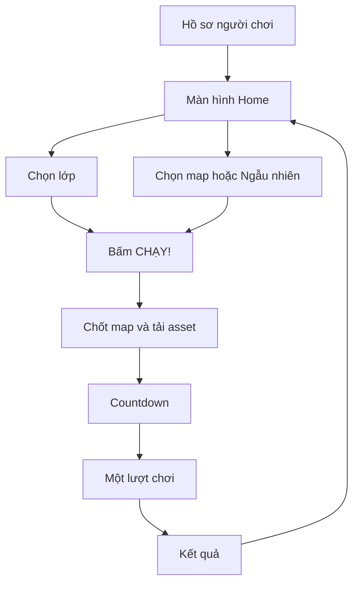
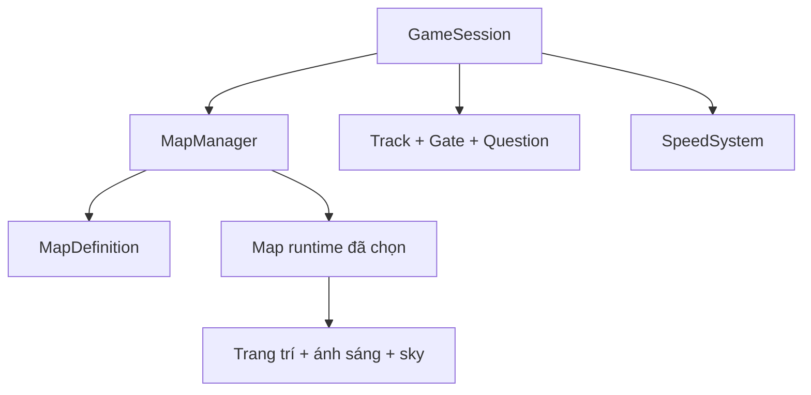

# YÊU CẦU HỆ THỐNG 5 MAP VÀ TỐC ĐỘ THEO ĐIỂM

> Tài liệu triển khai độc lập cho Claude Code  
> Dự án: **Đường Đua Toán Học 3D**  
> Phiên bản: **1.0**  
> Ngày cập nhật: **12/08/2026**  
> Phạm vi: chọn map, tải map, luân phiên map, kiến trúc môi trường 3D, tốc độ chạy tăng theo điểm và giới hạn tốc độ tối đa.

---

## 0. Prompt khởi động dành cho Claude Code

Có thể đưa nguyên khối dưới đây cho Claude Code trước khi bắt đầu:

```text
Hãy đọc toàn bộ file YEU_CAU_HE_THONG_5_MAP_VA_TOC_DO_GAME.md trước khi sửa code.

Mục tiêu của task:
1. Bổ sung đúng 5 map được mở sẵn:
   - rainbow-skyway
   - vietnam-countryside
   - cosmic-orbit
   - enchanted-forest
   - toy-city
2. Cho phép người chơi chọn map thủ công hoặc chọn "Ngẫu nhiên thông minh".
3. Mỗi lượt chơi chỉ dùng một map; không đổi map giữa lượt.
4. Map chỉ thay đổi hình ảnh, ánh sáng, âm thanh nền và trang trí. Map không được thay đổi làn chạy, câu hỏi, điểm, tốc độ hoặc độ khó.
5. Thay cơ chế tăng tốc sau mỗi câu bằng cơ chế tăng tốc theo ngưỡng điểm.
6. Tốc độ bắt đầu là 7.5, tăng 0.75 mỗi 300 điểm, tối đa tuyệt đối 11.25.
7. Dùng chuyển tốc mượt trong 0.65 giây và tự tăng khoảng cách cổng để giữ đủ thời gian đọc.
8. Cập nhật backend để run lưu mapId; server phải whitelist mapId và khóa mapId từ lúc start run.
9. Chỉ dùng code/thư viện open-source và asset có giấy phép CC0/OFL hoặc giấy phép mở đã được kiểm chứng.
10. Hoàn thành unit test, integration test, E2E, kiểm thử hiệu năng và checklist Definition of Done trong tài liệu.

Không tự ý thêm map thứ sáu, khóa map, vật phẩm tăng tốc, mua map, quảng cáo, obstacle gây thua, hay multiplier điểm theo map.

Nếu tài liệu này xung đột với phần tốc độ trong DAC_TA_GAME_DUONG_DUA_TOAN_HOC_3D.md thì tài liệu này được ưu tiên.
Nếu tài liệu này xung đột với API run trong YEU_CAU_HO_SO_NGUOI_CHOI_AVATAR_LEADERBOARD.md thì chỉ phần mapId và mapStats trong tài liệu này được ưu tiên; các quy tắc bảo mật và xác minh điểm của tài liệu hồ sơ vẫn giữ nguyên.
```

---

## 1. Mục tiêu sản phẩm

Hệ thống map phải tạo cảm giác mỗi lượt chơi là một chuyến phiêu lưu mới, nhưng không làm thay đổi tính công bằng của trò chơi Toán học.

Yêu cầu bắt buộc:

- Có đúng **5 map** ở phiên bản này.
- Cả 5 map được **mở sẵn ngay từ đầu**; không yêu cầu cày điểm để mở khóa.
- Người chơi có thể chọn một map cụ thể hoặc để game chọn bằng **Ngẫu nhiên thông minh**.
- Một lượt chơi chỉ sử dụng một map từ countdown đến Result.
- Việc đổi map diễn ra trước lượt tiếp theo, không diễn ra giữa một lượt.
- Mọi map dùng chung ba làn, logic cổng, bộ câu hỏi, công thức điểm và đường cong tốc độ.
- Tốc độ tăng theo **điểm hiện tại của lượt chơi**, tăng theo từng ngưỡng và dừng ở một mức tối đa.
- Tăng tốc không được làm trẻ mất thời gian đọc câu hỏi.
- Map phải nhiều màu sắc, dễ thương, mang cảm giác game 3D, không giống dashboard hoặc giao diện SaaS.
- Asset đưa vào bản phát hành phải có nguồn và giấy phép rõ ràng.

Ngoài phạm vi phiên bản này:

- Không có map trả phí.
- Không có map hiếm, hộp quà hoặc gacha.
- Không có obstacle gây chết hoặc rơi khỏi đường.
- Không có boss, chiến đấu hoặc vũ khí.
- Không có bảng xếp hạng riêng tạo lợi thế cho map.
- Không đổi map ngay trong một lượt chơi.
- Không tải đồng thời toàn bộ model và texture của cả 5 map.

---

## 2. Quy tắc ưu tiên so với tài liệu cũ

Tài liệu này thay thế các quy tắc tốc độ cũ sau:

| Quy tắc cũ                                     | Quy tắc mới bắt buộc                                                                               |
| ---------------------------------------------- | -------------------------------------------------------------------------------------------------- |
| Bắt đầu ở 8 đơn vị/giây                        | Bắt đầu ở 7,5 đơn vị/giây                                                                          |
| Tăng 0,28 sau mỗi câu                          | Chỉ tăng khi điểm vượt ngưỡng 300 điểm                                                             |
| Tối đa 12 đơn vị/giây                          | Tối đa tuyệt đối 11,25 đơn vị/giây                                                                 |
| Lớp 1 có ngoại lệ tốc độ riêng                 | Mọi lớp dùng cùng đường cong tốc độ; thời gian đọc được bảo vệ bằng khoảng cách cổng theo khối lớp |
| Trả lời sai làm chậm thế giới 15% trong 500 ms | Không thay đổi tốc độ do đúng/sai; dùng màu sắc, âm thanh và particle để phản hồi                  |

Không được giữ song song `+0.28/question` với hệ thống mới. Tại mọi thời điểm, tốc độ mục tiêu chỉ được suy ra từ điểm số hiện tại và cấu hình chung.

---

## 3. Danh sách 5 map chính thức

Các ID dưới đây là khóa dữ liệu ổn định. Sau khi đã có dữ liệu thật, không được đổi ID; chỉ được đổi tên hiển thị.

| STT | `mapId`               | Tên hiển thị            | Cảm xúc chính          | Màu chủ đạo                         |
| --: | --------------------- | ----------------------- | ---------------------- | ----------------------------------- |
|   1 | `rainbow-skyway`      | Đường Cầu Vồng          | Bay bổng, vui tươi     | Cyan, vàng, hồng, tím               |
|   2 | `vietnam-countryside` | Đường Làng Quê Việt Nam | Thân thuộc, ấm áp      | Xanh lúa, vàng nắng, nâu đất        |
|   3 | `cosmic-orbit`        | Đường Không Gian Vũ Trụ | Khám phá, kỳ thú       | Xanh đêm, tím, cyan neon            |
|   4 | `enchanted-forest`    | Rừng Cổ Tích            | Huyền ảo, dịu dàng     | Xanh lá, tím lavender, vàng đom đóm |
|   5 | `toy-city`            | Thành Phố Đồ Chơi       | Năng động, tinh nghịch | Đỏ, vàng, xanh dương, xanh lá       |

### 3.1. Quy tắc công bằng giữa các map

Mọi map bắt buộc dùng cùng:

- `LANE_X = [-3.2, 0, 3.2]` hoặc hằng số làn hiện có của dự án.
- Chiều rộng hành lang an toàn.
- Vị trí trigger cổng.
- Cơ chế chuyển làn.
- Công thức tạo câu hỏi.
- Công thức tính điểm.
- Bảng ngưỡng tốc độ.
- Thời gian đọc tối thiểu.
- Số câu mỗi lượt.

Các trường sau trong cấu hình map phải luôn bằng `1` hoặc không được tồn tại:

```ts
speedMultiplier: 1;
scoreMultiplier: 1;
questionDifficultyMultiplier: 1;
```

Map không được đặt collider vào ba làn chạy. Xe, đá, cây, nhà, hành tinh, đồ chơi và các vật trang trí chỉ được đặt ngoài hành lang an toàn hoặc ở nền xa.

---

## 4. Trải nghiệm chọn map

### 4.1. Vị trí trong luồng game

Luồng chính sau khi bổ sung map:



Không cần tạo màn hình form riêng có cảm giác như phần mềm quản trị. Bộ chọn map nằm ngay trên Home như một khu vực **bản đồ phiêu lưu**.

### 4.2. Hình thức giao diện

Thiết kế bộ chọn như một bệ trưng bày đồ chơi/diorama:

- Ở giữa là ảnh preview lớn của map đang chọn.
- Hai bên là nút mũi tên dạng biển chỉ đường hoặc nút arcade.
- Phía dưới có năm chấm/icon nhỏ để thể hiện vị trí trong carousel.
- Tên map dùng font display tròn, đậm, dễ đọc.
- Có một huy hiệu dạng xúc xắc hoặc la bàn ghi **NGẪU NHIÊN THÔNG MINH**.
- Map được chọn có ánh sáng viền, bụi sao hoặc confetti nhẹ; không dùng khung card chữ nhật kiểu dashboard.
- Khi đổi map, preview chuyển bằng pan/fade trong 250–350 ms.
- Trên mobile dùng swipe ngang và hai nút mũi tên lớn tối thiểu 48×48 CSS px.
- Không đặt đoạn mô tả dài. Mỗi map chỉ cần tên và một câu ngắn tối đa 45 ký tự.

Nội dung microcopy:

| Map/chế độ            | Dòng mô tả                              |
| --------------------- | --------------------------------------- |
| Đường Cầu Vồng        | `Lướt qua mây và những vòm sắc màu!`    |
| Làng Quê Việt Nam     | `Chạy giữa đồng lúa và hàng tre xanh!`  |
| Không Gian Vũ Trụ     | `Bay qua hành tinh và trạm không gian!` |
| Rừng Cổ Tích          | `Khám phá nấm khổng lồ và đom đóm!`     |
| Thành Phố Đồ Chơi     | `Đua giữa những khối đồ chơi tí hon!`   |
| Ngẫu nhiên thông minh | `Mỗi lượt một hành trình mới!`          |

### 4.3. Ảnh preview map

Không tải model nặng chỉ để hiển thị carousel.

- Mỗi map có thumbnail WebP 16:9, kích thước nguồn 960×540.
- Mỗi thumbnail mục tiêu dưới 100 KB, giới hạn cứng 160 KB.
- Thumbnail phải là ảnh chụp từ chính scene trong game, không dùng mockup không giống sản phẩm thật.
- Tạo route phát triển:

```text
/?previewMap=rainbow-skyway&previewSeed=1001&ui=0
```

- Dùng Playwright chụp cùng camera, cùng giờ ánh sáng và seed cố định.
- Lưu tại `public/assets/maps/<mapId>/thumbnail.webp`.
- Có `alt` tiếng Việt cho thumbnail trong phần DOM của bộ chọn.

### 4.4. Ghi nhớ lựa chọn

Lưu lựa chọn gần nhất:

```ts
export type MapSelectionMode = 'manual' | 'smart-random';

export interface SavedMapPreference {
  mode: MapSelectionMode;
  selectedMapId: MapId;
  updatedAt: string;
}
```

Khóa local đề xuất:

```text
math-runner.map-preference.v1
```

Nếu người chơi chưa từng chọn:

- Chế độ mặc định: `smart-random`.
- Preview ban đầu: `rainbow-skyway`.
- Khi bấm chạy, thuật toán mới chốt map thực tế.

---

## 5. Ngẫu nhiên thông minh

### 5.1. Mục tiêu

Ngẫu nhiên thông minh phải:

- Không lặp lại map vừa chơi nếu còn map khác đang bật.
- Ưu tiên map ít xuất hiện trong 10 lượt gần nhất.
- Nếu bằng nhau, ưu tiên map có tổng số lượt chơi thấp hơn.
- Nếu vẫn bằng nhau, chọn ngẫu nhiên bằng RNG có thể test.
- Không chọn map đang `enabled: false`.

### 5.2. Dữ liệu thống kê tối thiểu

```ts
export interface PlayerMapStats {
  recentMapIds: MapId[]; // mới nhất ở đầu, tối đa 10 phần tử
  totalPlays: Partial<Record<MapId, number>>;
  lastPlayedMapId: MapId | null;
}
```

### 5.3. Thuật toán chuẩn

```ts
export function chooseSmartMap(
  enabledMapIds: readonly MapId[],
  stats: PlayerMapStats,
  rng: () => number = Math.random,
): MapId {
  if (enabledMapIds.length === 0) {
    throw new Error('No enabled maps');
  }

  const withoutImmediateRepeat = enabledMapIds.filter((id) => id !== stats.lastPlayedMapId);

  const candidates =
    withoutImmediateRepeat.length > 0 ? withoutImmediateRepeat : [...enabledMapIds];

  const recentCount = (id: MapId) =>
    stats.recentMapIds.filter((recentId) => recentId === id).length;

  const minRecentCount = Math.min(...candidates.map(recentCount));
  const leastRecent = candidates.filter((id) => recentCount(id) === minRecentCount);

  const minTotalPlays = Math.min(...leastRecent.map((id) => stats.totalPlays[id] ?? 0));
  const leastPlayed = leastRecent.filter((id) => (stats.totalPlays[id] ?? 0) === minTotalPlays);

  const index = Math.min(leastPlayed.length - 1, Math.floor(rng() * leastPlayed.length));

  return leastPlayed[index];
}
```

Không dùng `array.sort(() => Math.random() - 0.5)` vì khó test và cho phân phối không ổn định.

### 5.4. Thời điểm chốt map

1. Người chơi chọn lớp và chế độ map.
2. Khi bấm `CHẠY!`, client xác định `mapId` nếu là smart-random.
3. Client gọi `POST /runs/start` với `grade` và `mapId`.
4. Server whitelist và lưu `mapId` vào run.
5. Client tải map mà server trả về.
6. Chỉ bắt đầu countdown khi map đã sẵn sàng hoặc fallback đã sẵn sàng.
7. Từ thời điểm này đến Result, `mapId` là bất biến.

---

## 6. Thiết kế chi tiết từng map

### 6.1. Map 1 — Đường Cầu Vồng

**ID:** `rainbow-skyway`

### Hình ảnh

- Đường chạy nổi giữa bầu trời, có lan can mềm như đồ chơi.
- Mặt đường màu trắng ngà hoặc xanh trời nhạt để cổng đáp án nổi bật.
- Hai bên đường có các dải cầu vồng, đảo mây, sao nhỏ, bóng bay và cối xay gió đồ chơi.
- Phía xa có vòm cầu vồng lớn làm landmark.
- Bầu trời xanh sáng, mây trắng; không dùng sương dày che cổng.
- Mặt dưới đường có thể phát sáng nhẹ, nhưng không dùng chớp nháy liên tục.

### Segment trang trí

Tạo tối thiểu năm segment tái sử dụng:

1. `cloud-islands`
2. `rainbow-arches`
3. `star-garden`
4. `balloon-valley`
5. `sunny-windmills`

Không đặt vòm trang trí trùng với silhouette của cổng đáp án. Vòm trang trí phải ở cao hơn, rộng hơn hoặc nằm lệch khỏi đường.

### Ánh sáng và hiệu ứng

```ts
fogColor: '#BDEEFF';
hemisphereSkyColor: '#A8E8FF';
hemisphereGroundColor: '#F7E7A9';
keyLightColor: '#FFF4C7';
particlePreset: 'soft-stars';
```

Particle tối đa 35 phần tử thấy cùng lúc trên mobile. Không dùng bloom mạnh làm mờ chữ đáp án.

### Nguồn asset đề xuất

- [Kenney Platformer Kit](https://kenney.nl/assets/platformer-kit) — CC0.
- [Kenney Skyboxes](https://kenney.nl/assets/skyboxes) — CC0.
- Các dải cầu vồng, mây đơn giản, ngôi sao và lan can nên tạo bằng Three.js primitives hoặc SVG/code của dự án.

### 6.2. Map 2 — Đường Làng Quê Việt Nam

**ID:** `vietnam-countryside`

### Hình ảnh

- Con đường chạy xuyên giữa đồng lúa xanh/vàng.
- Hàng tre, bụi chuối, ao sen, mương nước nhỏ và nhà mái ngói đỏ xuất hiện ở hai bên.
- Có cầu gỗ hoặc cầu gạch nhỏ ở nền; mặt đường gameplay vẫn phẳng và thẳng.
- Xa xa có làng nhỏ và dãy núi xanh nhạt.
- Ánh sáng buổi sáng ấm, trời xanh, mây mỏng.
- Có thể có trâu, cò hoặc xe đạp dạng silhouette/low-poly ở ngoài xa, không di chuyển cắt qua làn.

### Yêu cầu thể hiện văn hóa

- Ưu tiên chi tiết quen thuộc của làng quê Việt Nam: ruộng lúa, hàng tre, cây chuối, ao sen, mái ngói thấp, đường đất/gạch.
- Không dùng chùa Nhật, cổng torii, đèn lồng Trung Hoa hoặc kiến trúc Đông Á chung chung thay cho hình ảnh Việt Nam.
- Không nhồi quá nhiều biểu tượng quốc gia vào cảnh.
- Hình ảnh phải vui tươi, tôn trọng và phù hợp trẻ em; không biến nông thôn thành nghèo nàn hoặc cũ kỹ.
- Các chi tiết đặc trưng Việt Nam nên được dựng nguyên bản bằng primitives/Blender rồi phát hành cùng source, tránh lấy model không rõ nguồn trên Internet.

### Segment trang trí

1. `green-rice-fields`
2. `bamboo-gate`
3. `lotus-pond`
4. `tile-roof-hamlet`
5. `banana-garden`
6. `harvest-fields`

Dùng `InstancedMesh` cho lúa và cụm tre. Cánh đồng không cần hàng nghìn mesh rời.

### Ánh sáng và hiệu ứng

```ts
fogColor: '#D7F1D0';
hemisphereSkyColor: '#A9DFFF';
hemisphereGroundColor: '#9EBD58';
keyLightColor: '#FFE3A0';
particlePreset: 'pollen-light';
```

Không dùng sương mù dày. Có thể làm lúa lay nhẹ bằng shader hoặc animation theo cụm, nhưng phải tắt khi `prefers-reduced-motion` hoặc quality thấp.

### Nguồn asset đề xuất

- [Quaternius Farm Buildings Pack](https://quaternius.com/packs/farmbuildings.html) — kiểm tra file giấy phép đi kèm khi tải.
- [Quaternius Ultimate Nature Pack](https://quaternius.com/packs/ultimatenature.html) — CC0.
- [Quaternius Stylized Nature MegaKit](https://quaternius.com/packs/stylizednaturemegakit.html) — CC0.
- Tre, lúa, sen, mái ngói và nhà Việt Nam nên là asset nguyên bản của dự án hoặc hình khối procedural.

### 6.3. Map 3 — Đường Không Gian Vũ Trụ

**ID:** `cosmic-orbit`

### Hình ảnh

- Đường chạy là một sàn tàu/quỹ đạo có viền sáng cyan.
- Nền là bầu trời sao, hành tinh lớn, mặt trăng nhỏ và tinh vân màu tím nhẹ.
- Hai bên có vệ tinh, module trạm vũ trụ, ăng-ten, thiên thạch ở xa.
- Có landmark là hành tinh có vành đai hoặc trạm không gian tròn.
- Cổng Toán học vẫn giữ màu gameplay chung; không hòa vào màu neon nền.

### Segment trang trí

1. `orbital-station`
2. `ringed-planet-pass`
3. `satellite-alley`
4. `safe-asteroid-field`
5. `comet-viewpoint`

Thiên thạch chỉ bay ở nền hoặc ngoài hành lang an toàn. Không có va chạm, mất máu hoặc màn hình nổ.

### Ánh sáng và hiệu ứng

```ts
fogColor: '#151A46';
hemisphereSkyColor: '#4C5BD4';
hemisphereGroundColor: '#161B3E';
keyLightColor: '#B9D9FF';
particlePreset: 'slow-stars';
```

Giới hạn độ tương phản. Không dùng strobe, laser quét qua chữ, camera shake hoặc chromatic aberration mạnh.

### Nguồn asset đề xuất

- [Kenney Space Kit](https://kenney.nl/assets/space-kit) — CC0.
- [Kenney Skyboxes](https://kenney.nl/assets/skyboxes) — CC0.
- Các vệt sao nên dùng particle texture tự tạo bằng canvas, không cần tải ảnh ngoài.

### 6.4. Map 4 — Rừng Cổ Tích

**ID:** `enchanted-forest`

### Hình ảnh

- Đường chạy xuyên rừng cây thân lớn, tán cao để không che HUD.
- Hai bên có nấm khổng lồ, hoa nhiều màu, đá pha lê và đom đóm.
- Có suối nhỏ ở ngoài đường và lâu đài xa làm landmark.
- Không khí kỳ ảo nhưng sáng, thân thiện; không tạo cảm giác rừng kinh dị.
- Mặt đường màu đất sáng hoặc đá pastel để nhân vật và cổng có độ tương phản tốt.

### Segment trang trí

1. `giant-mushroom-grove`
2. `crystal-brook`
3. `flower-archway`
4. `firefly-hollow`
5. `castle-overlook`

Nấm và cây không được phủ lên đường. Đom đóm di chuyển chậm, không chớp sáng nhanh.

### Ánh sáng và hiệu ứng

```ts
fogColor: '#CFE7D2';
hemisphereSkyColor: '#C7D7FF';
hemisphereGroundColor: '#6E8C58';
keyLightColor: '#FFF0B5';
particlePreset: 'fireflies';
```

### Nguồn asset đề xuất

- [Kenney Nature Kit](https://kenney.nl/assets/nature-kit) — CC0.
- [Kenney Mini Forest](https://kenney.nl/assets/mini-forest) — CC0.
- [Kenney Fantasy Town Kit](https://kenney.nl/assets/fantasy-town-kit) — CC0.
- [Kenney Castle Kit](https://kenney.nl/assets/castle-kit) — CC0.

### 6.5. Map 5 — Thành Phố Đồ Chơi

**ID:** `toy-city`

### Hình ảnh

- Đường chạy trông như một đường đua đồ chơi đặt trên bàn/phòng chơi khổng lồ.
- Hai bên có khối xếp hình, gara tí hon, biển báo, cọc tiêu, xe đồ chơi và nhà màu pastel.
- Một đoàn tàu đồ chơi có thể chạy ở nền song song với đường, không cắt qua gameplay.
- Landmark là tháp khối xếp hình hoặc vòng đu quay đồ chơi.
- Tỉ lệ vật thể hơi phóng đại để tạo cảm giác người chơi đang ở trong thế giới đồ chơi.

### Segment trang trí

1. `building-block-boulevard`
2. `tiny-garage`
3. `toy-train-park`
4. `traffic-cone-plaza`
5. `mini-airport-view`

Xe đồ chơi chỉ là trang trí. Không xuất hiện xe tăng có hành vi bắn hoặc nội dung chiến đấu; nếu dùng hình xe tăng làm avatar thì thể hiện như đồ chơi đáng yêu, không liên quan map gameplay.

### Ánh sáng và hiệu ứng

```ts
fogColor: '#D8F0FF';
hemisphereSkyColor: '#BFE5FF';
hemisphereGroundColor: '#FFD7A8';
keyLightColor: '#FFF0C6';
particlePreset: 'confetti-sparse';
```

### Nguồn asset đề xuất

- [Kenney Toy Car Kit](https://kenney.nl/assets/toy-car-kit) — CC0.
- [Kenney Fantasy Town Kit](https://kenney.nl/assets/fantasy-town-kit) — CC0.
- Khối xếp hình, đường ray và biển báo đơn giản nên tạo bằng primitives để giảm dung lượng.

---

## 7. Nguồn tài nguyên và giấy phép

### 7.1. Chính sách bắt buộc

- Source code của game: MIT hoặc giấy phép tương thích với dự án.
- Model, texture, ảnh: ưu tiên CC0.
- Font: OFL.
- Âm thanh/nhạc: CC0 hoặc giấy phép mở cho phép chỉnh sửa và phân phối lại.
- Không lấy asset từ Google Images, Pinterest, video YouTube, trang tổng hợp không có license rõ ràng hoặc link tải lại không phải tác giả.
- Không hotlink file asset từ website bên thứ ba trong production.
- Mọi asset phải được tải về, tối ưu và phục vụ từ chính dự án.
- Mỗi gói tải về phải giữ bản license/readme gốc trong kho notice hoặc ghi URL, tác giả, license và ngày truy cập.

[Kenney xác nhận asset trên các trang asset của họ dùng CC0](https://kenney.nl/support). Danh mục [Quaternius](https://quaternius.com/) cung cấp nhiều gói low-poly miễn phí; Claude Code vẫn phải đọc license đi kèm từng file tải về trước khi nhập vào dự án.

### 7.2. File kê khai bắt buộc

Tạo hoặc cập nhật:

```text
ASSET_SOURCES.md
THIRD_PARTY_NOTICES.md
```

Mỗi mục asset phải có:

```md
## Kenney Space Kit

- Used in: cosmic-orbit
- Source: https://kenney.nl/assets/space-kit
- Author: Kenney
- License: CC0 1.0
- Downloaded: YYYY-MM-DD
- Local paths: public/assets/maps/cosmic-orbit/models/...
- Modifications: converted to GLB, unused meshes removed, textures resized
```

### 7.3. Quy trình download/import

1. Tải zip từ trang chính thức.
2. Giải nén vào thư mục làm việc tạm, không copy toàn bộ pack vào production.
3. Đọc `License`, `Readme` hoặc thông tin license trên trang chính thức.
4. Chỉ chọn model thực sự xuất hiện trong map.
5. Chuyển model sang GLB/glTF nếu cần.
6. Gộp texture atlas khi hợp lý.
7. Resize texture; mobile không cần texture 4K.
8. Chạy công cụ tối ưu glTF.
9. Copy asset đã tối ưu vào đúng thư mục map.
10. Ghi nguồn vào `ASSET_SOURCES.md` và notice.
11. Chạy `npm run assets:validate` để phát hiện file quá lớn, file thiếu notice hoặc đường dẫn sai.

Không commit nguyên các file Blender/FBX lớn vào bundle frontend. Có thể lưu file nguồn trong `art-source/` nếu repository chấp nhận dung lượng; production chỉ tải file đã tối ưu.

### 7.4. Âm thanh theo map

MVP tiếp tục dùng nhạc nền và SFX chung đã được duyệt ở tài liệu game chính.

- Không bắt buộc có năm bản nhạc riêng trong phiên bản này.
- Mỗi map có thể có một ambience rất nhẹ ở giai đoạn sau.
- Ambience không được lấn tiếng đọc câu hỏi hoặc SFX đúng/sai.
- Nếu chưa tìm được file CC0 phù hợp, bỏ ambience; không dùng asset không rõ license để đủ số lượng.

---

## 8. Kiến trúc code của hệ thống map

### 8.1. Nguyên tắc tách lớp

Phần gameplay không được import trực tiếp module của từng map.



`TrackSystem`, `GateSystem`, `QuestionSystem`, `ScoringSystem` và `SpeedSystem` là dùng chung. Map runtime chỉ quản lý môi trường nhìn/nghe.

### 8.2. Kiểu dữ liệu chung

```ts
export const MAP_IDS = [
  'rainbow-skyway',
  'vietnam-countryside',
  'cosmic-orbit',
  'enchanted-forest',
  'toy-city',
] as const;

export type MapId = (typeof MAP_IDS)[number];

export interface MapPalette {
  fog: string;
  sky: string;
  ground: string;
  keyLight: string;
  track: string;
  trackEdge: string;
}

export interface MapQualityBudget {
  maxVisibleTrianglesMobile: number;
  maxVisibleTrianglesDesktop: number;
  maxDrawCallsMobile: number;
  maxDrawCallsDesktop: number;
}

export interface MapDefinition {
  id: MapId;
  displayName: string;
  description: string;
  enabled: boolean;
  sortOrder: number;
  thumbnailUrl: string;
  assetBaseUrl: string;
  palette: MapPalette;
  particlePreset: ParticlePresetId;
  segmentIds: readonly string[];
  qualityBudget: MapQualityBudget;
  manifestVersion: 1;
}

export interface MapRuntime {
  readonly id: MapId;
  readonly root: THREE.Group;
  update(deltaSeconds: number, worldSpeed: number): void;
  recycle(playerZ: number): void;
  setQuality(tier: QualityTier): void;
  setReducedMotion(reduced: boolean): void;
  dispose(): void;
}
```

### 8.3. Manifest dùng chung client/server

Tạo một module không phụ thuộc Three.js:

```text
packages/shared/src/maps/map-manifest.ts
```

Nếu dự án chưa dùng monorepo, đặt tại:

```text
src/shared/map-manifest.ts
```

Backend phải import cùng `MAP_IDS`/validator hoặc dùng file JSON được sinh từ cùng nguồn. Không sao chép danh sách ID thủ công ở nhiều nơi.

`enabled` dùng để tạm ẩn map bị lỗi trong một bản phát hành. Không dùng `enabled` để khóa map theo tài khoản.

### 8.4. Cấu trúc thư mục đề xuất

```text
src/
├── game/
│   ├── maps/
│   │   ├── MapManager.ts
│   │   ├── MapAssetCache.ts
│   │   ├── MapSegmentPool.ts
│   │   ├── map-types.ts
│   │   ├── map-manifest.ts
│   │   ├── rainbow-skyway/
│   │   │   ├── createRainbowSkyway.ts
│   │   │   └── segments.ts
│   │   ├── vietnam-countryside/
│   │   │   ├── createVietnamCountryside.ts
│   │   │   └── segments.ts
│   │   ├── cosmic-orbit/
│   │   │   ├── createCosmicOrbit.ts
│   │   │   └── segments.ts
│   │   ├── enchanted-forest/
│   │   │   ├── createEnchantedForest.ts
│   │   │   └── segments.ts
│   │   └── toy-city/
│   │       ├── createToyCity.ts
│   │       └── segments.ts
│   ├── speed/
│   │   ├── SpeedSystem.ts
│   │   ├── speed-config.ts
│   │   └── gate-spacing.ts
│   └── session/
│       └── GameSession.ts
├── ui/
│   ├── map-selector/
│   │   ├── MapSelector.ts
│   │   ├── MapPreview.ts
│   │   └── map-selector.css
│   └── hud/
│       └── SpeedMeter.ts
└── shared/
    └── map-manifest.ts

public/assets/maps/
├── shared/
├── rainbow-skyway/
├── vietnam-countryside/
├── cosmic-orbit/
├── enchanted-forest/
└── toy-city/
```

### 8.5. Vòng đời MapManager

```ts
interface MapManager {
  preloadThumbnailAssets(): Promise<void>;
  load(mapId: MapId, options: LoadMapOptions): Promise<MapRuntime>;
  activate(runtime: MapRuntime): void;
  update(deltaSeconds: number, worldSpeed: number): void;
  disposeActiveMap(): void;
}
```

Luồng `load`:

1. Kiểm tra `mapId` trong manifest và `enabled`.
2. Hiện loading overlay có tên/thumbnail map.
3. Tải phần shared nếu chưa có.
4. Lazy-load JS module của map bằng dynamic import.
5. Tải model/texture của riêng map.
6. Tạo runtime và warm up shader trong scene loading nếu cần.
7. Nếu thành công, activate rồi mới cho countdown.
8. Nếu lỗi hoặc quá timeout, ghi log và tải `fallbackMap` nhẹ.

Không bắt đầu câu hỏi khi map còn đang tải.

### 8.6. Fallback bắt buộc

Tạo một môi trường fallback bằng Three.js primitives, không phụ thuộc file GLB:

- Bầu trời gradient.
- Đường chạy màu sáng.
- Vài mây/cây hình học đơn giản.
- Ánh sáng hemisphere + directional.
- Không cần thumbnail riêng.

Fallback chỉ dùng khi asset map bị lỗi. `run.mapId` vẫn giữ ID server đã chốt để không làm sai audit; client có thể log `renderedFallback: true`.

UI loading lỗi dùng thông điệp thân thiện:

```text
Bản đồ đang được sửa đường một chút!
Mình sẽ chạy trên đường dự phòng nhé.
```

### 8.7. Segment và tái sử dụng thế giới

- Mỗi map có tối thiểu 5 segment trang trí.
- Giữ 4–6 segment trước camera và 1–2 segment phía sau tùy draw distance.
- Khi segment ra sau camera, đưa về phía trước và đổi biến thể.
- Dùng object pool; không tạo/hủy hàng chục object mỗi frame.
- Chọn segment bằng RNG có seed từ run để cảnh có thể tái tạo khi debug.
- Không đặt cùng segment quá hai lần liên tiếp.
- Track trung tâm có thể dùng chung geometry; map chỉ thay material và viền.
- Các chuyển động nền phải dựa trên `deltaSeconds`, không dựa trên số frame.

### 8.8. Giải phóng tài nguyên

Khi rời map:

- Dừng animation mixer của map.
- Gỡ event listener do map tạo.
- Xóa particle emitter.
- Dispose geometry/material/texture chỉ thuộc map và không còn reference.
- Giữ shared asset trong cache có giới hạn.
- Không dispose material/texture dùng chung khi map khác vẫn sử dụng.

Trong development, thêm bộ đếm để phát hiện số geometry, texture và program tăng sau mỗi lần đổi map.

---

## 9. Hệ thống tốc độ theo điểm

### 9.1. Bảng tốc độ chính thức

| Điểm hiện tại | Bậc hiển thị |   Tốc độ mục tiêu |
| ------------: | -----------: | ----------------: |
|         0–299 |          1/6 |  7,50 đơn vị/giây |
|       300–599 |          2/6 |  8,25 đơn vị/giây |
|       600–899 |          3/6 |  9,00 đơn vị/giây |
|     900–1.199 |          4/6 |  9,75 đơn vị/giây |
|   1.200–1.499 |          5/6 | 10,50 đơn vị/giây |
|      Từ 1.500 |    6/6 — MAX | 11,25 đơn vị/giây |

`11.25` là trần cứng. Dù điểm là 1.500, 10.000 hay bất kỳ giá trị lớn nào, tốc độ mục tiêu không được vượt 11,25.

### 9.2. Cấu hình nguồn duy nhất

```ts
export const SPEED_CONFIG = Object.freeze({
  baseSpeed: 7.5,
  pointsPerTier: 300,
  speedPerTier: 0.75,
  maxTierIndex: 5, // 0..5 tương ứng 6 bậc hiển thị
  maxSpeed: 11.25,
  transitionSeconds: 0.65,
});

export function speedTierForScore(score: number): number {
  const safeScore = Math.max(0, Math.floor(Number.isFinite(score) ? score : 0));
  return Math.min(Math.floor(safeScore / SPEED_CONFIG.pointsPerTier), SPEED_CONFIG.maxTierIndex);
}

export function targetSpeedForScore(score: number): number {
  const tier = speedTierForScore(score);
  const calculated = SPEED_CONFIG.baseSpeed + tier * SPEED_CONFIG.speedPerTier;

  return Math.min(calculated, SPEED_CONFIG.maxSpeed);
}
```

Không viết lại các con số này trong component HUD, map hoặc GameSession. Tất cả phải import từ `speed-config.ts`.

### 9.3. Thời điểm cập nhật tốc độ

- Bắt đầu run: `score = 0`, target = 7,5.
- Khi người chơi qua cổng, câu trả lời được chấm.
- Client tính điểm preview bằng cùng hàm scoring thuần dùng chung.
- Sau khi điểm mới đã được cộng, tính lại speed tier.
- Nếu tier tăng, chuyển mượt từ tốc độ hiện tại tới target mới.
- Nếu câu sai và không có điểm, tier không đổi.
- Điểm không giảm nên tốc độ không giảm trong lượt.
- Khi tạo run mới, reset hoàn toàn về 7,5.
- Pause giữ nguyên current/target speed; resume không cộng thời gian pause vào transition.

Tốc độ không được thay đổi do:

- Số thứ tự câu hỏi.
- Map đang chơi.
- Combo trực tiếp.
- Avatar.
- Tuổi hoặc nickname.
- FPS thiết bị.
- Resize trình duyệt.
- Bấm liên tục nút điều khiển.

Combo có thể làm điểm tăng nhanh hơn và gián tiếp vượt ngưỡng sớm hơn; đó là hành vi hợp lệ. Không được nhân thêm tốc độ bằng combo.

### 9.4. Chuyển tốc mượt

Không gán tức thì `currentSpeed = targetSpeed` khi qua ngưỡng. Dùng interpolation độc lập FPS trong khoảng 0,65 giây.

```ts
export class SpeedSystem {
  private current = SPEED_CONFIG.baseSpeed;
  private target = SPEED_CONFIG.baseSpeed;
  private transitionElapsed = SPEED_CONFIG.transitionSeconds;
  private transitionStart = SPEED_CONFIG.baseSpeed;
  private lastTier = 0;

  reset(): void {
    this.current = SPEED_CONFIG.baseSpeed;
    this.target = SPEED_CONFIG.baseSpeed;
    this.transitionStart = SPEED_CONFIG.baseSpeed;
    this.transitionElapsed = SPEED_CONFIG.transitionSeconds;
    this.lastTier = 0;
  }

  applyScore(score: number): SpeedTierChange | null {
    const nextTier = speedTierForScore(score);
    const nextTarget = targetSpeedForScore(score);

    if (nextTarget <= this.target) return null;

    const change = { fromTier: this.lastTier, toTier: nextTier };
    this.transitionStart = this.current;
    this.transitionElapsed = 0;
    this.target = Math.min(nextTarget, SPEED_CONFIG.maxSpeed);
    this.lastTier = nextTier;
    return change;
  }

  update(deltaSeconds: number): number {
    this.transitionElapsed = Math.min(
      this.transitionElapsed + Math.max(0, deltaSeconds),
      SPEED_CONFIG.transitionSeconds,
    );

    const t = Math.min(this.transitionElapsed / SPEED_CONFIG.transitionSeconds, 1);
    const eased = 1 - Math.pow(1 - t, 3);
    const next = this.transitionStart + (this.target - this.transitionStart) * eased;

    this.current = Math.min(Math.max(SPEED_CONFIG.baseSpeed, next), SPEED_CONFIG.maxSpeed);
    return this.current;
  }

  getCurrent(): number {
    return Math.min(this.current, SPEED_CONFIG.maxSpeed);
  }
}
```

Clamp tại cả `applyScore`, `update` và nơi GameSession đọc tốc độ. Phòng thủ nhiều lớp để một thay đổi sau này không vô tình vượt max.

### 9.5. Bảo vệ thời gian đọc câu hỏi

Tăng tốc không được biến thành giảm thời gian đọc. Khoảng cách từ lúc câu hỏi xuất hiện đến cổng tương ứng phải tính theo tốc độ dự kiến.

| Khối lớp | Thời gian đọc tối thiểu |
| -------- | ----------------------: |
| Lớp 1    |                5,5 giây |
| Lớp 2    |                5,0 giây |
| Lớp 3–5  |                4,5 giây |

Cấu hình:

```ts
const MIN_READING_SECONDS_BY_GRADE: Record<Grade, number> = {
  1: 5.5,
  2: 5.0,
  3: 4.5,
  4: 4.5,
  5: 4.5,
};

const BASE_GATE_DISTANCE = 48;
const SAFETY_MARGIN_WORLD_UNITS = 6;

export function gateDistanceForQuestion(
  grade: Grade,
  currentSpeed: number,
  targetSpeed: number,
): number {
  const planningSpeed = Math.min(Math.max(currentSpeed, targetSpeed), SPEED_CONFIG.maxSpeed);

  return Math.max(
    BASE_GATE_DISTANCE,
    planningSpeed * MIN_READING_SECONDS_BY_GRADE[grade] + SAFETY_MARGIN_WORLD_UNITS,
  );
}
```

Ví dụ ở tốc độ tối đa:

- Lớp 1: `11,25 × 5,5 + 6 = 67,875` đơn vị.
- Lớp 2: `11,25 × 5,0 + 6 = 62,25` đơn vị.
- Lớp 3–5: `11,25 × 4,5 + 6 = 56,625` đơn vị.

Có thể làm tròn lên theo chiều dài segment, tuyệt đối không làm tròn xuống khiến thời gian đọc thấp hơn quy định.

`responseMs` bắt đầu khi câu hỏi và ba đáp án đã render rõ ràng. Không bắt đầu timer khi asset/cổng còn loading.

### 9.6. Tránh vòng lặp giữa điểm và tốc độ

Thưởng tốc độ câu hỏi vẫn được tính từ `responseMs` theo công thức scoring hiện có. Thứ tự bắt buộc:

1. Hiển thị câu hỏi N với speed tier hiện tại.
2. Người chơi qua cổng N.
3. Chấm câu N và tính toàn bộ điểm của câu.
4. Cộng vào tổng điểm.
5. Từ tổng điểm mới, tính tốc độ cho câu N+1.
6. Tính khoảng cách cổng N+1 từ tốc độ mới và thời gian đọc tối thiểu.

Không thay speed tier giữa lúc đang trả lời cùng một câu. Như vậy không có vòng lặp trong đó điểm của câu tự làm cổng của chính câu đó đến sớm hơn.

### 9.7. Phản hồi khi tăng tốc

Khi vượt một ngưỡng:

- Hiện chữ `TĂNG TỐC!` trong 700–900 ms.
- Làm sáng thêm một nấc trên Speed Meter.
- Phát SFX ngắn, vui, không chói tai.
- Tăng FOV rất nhẹ từ 52 ở bậc 1 đến tối đa 58 ở bậc 6.
- Tăng nhẹ mật độ vệt gió/trail, vẫn trong particle budget.
- Không rung camera.

Khi chạm bậc 6 lần đầu:

```text
TỐC ĐỘ TỐI ĐA!
```

Thông điệp chỉ hiện một lần mỗi run. Điểm tiếp tục tăng nhưng Speed Meter không tạo thêm nấc.

### 9.8. Speed Meter trên HUD

Không cần hiển thị `11.25 units/s` cho trẻ.

- Dùng icon giày chạy, tia chớp hoặc tên lửa nhỏ.
- Có sáu nấc hình viên kẹo/đèn arcade.
- Nấc đã đạt sáng vàng/cyan, nấc chưa đạt dùng màu dịu.
- Nhãn ở bậc cuối: `MAX`.
- Có `aria-label`, ví dụ `Tốc độ bậc 4 trên 6`.
- Không để Speed Meter che câu hỏi hoặc đồng hồ.

### 9.9. Reduced motion

Khi `prefers-reduced-motion: reduce`:

- Vẫn tăng tốc gameplay theo bảng trên.
- Tắt FOV animation; giữ FOV cố định.
- Giảm/tắt speed lines và particle trang trí.
- Chuyển Speed Meter bằng fade ngắn, không bounce mạnh.
- Không camera shake trong mọi chế độ.

---

## 10. Đồng bộ map và tốc độ với game loop

World movement phải dùng tốc độ đã clamp và `deltaSeconds` đã giới hạn:

```ts
const safeDelta = Math.min(clock.getDelta(), 0.05);
const worldSpeed = Math.min(speedSystem.update(isPaused ? 0 : safeDelta), SPEED_CONFIG.maxSpeed);

if (!isPaused) {
  trackSystem.update(safeDelta, worldSpeed);
  gateSystem.update(safeDelta, worldSpeed);
  activeMap.update(safeDelta, worldSpeed);
}
```

Không dùng số pixel/frame cố định. Không để tab quay lại sau nhiều giây tạo một bước nhảy cực lớn.

Nếu FPS thấp:

- Cổng vẫn phải dùng swept crossing như tài liệu game chính.
- Tốc độ logic không vượt max để “bù FPS”.
- Có thể giảm quality đồ họa, không giảm thời gian đọc.
- Không chấm hai câu cùng một frame.

---

## 11. Backend và dữ liệu

### 11.1. Thay đổi SQLite

Tạo migration mới, ví dụ:

```text
server/migrations/002_add_map_to_game_runs.sql
```

Với database đã tồn tại:

```sql
ALTER TABLE game_runs
ADD COLUMN map_id TEXT NOT NULL DEFAULT 'rainbow-skyway';

ALTER TABLE game_runs
ADD COLUMN map_manifest_version INTEGER NOT NULL DEFAULT 1;

CREATE INDEX idx_runs_map_finished
ON game_runs(map_id, status, finished_at);
```

SQLite có giới hạn khi thêm `CHECK` bằng `ALTER TABLE`; server bắt buộc whitelist bằng manifest dùng chung. Khi tạo database mới, schema đầy đủ nên có:

```sql
map_id TEXT NOT NULL,
map_manifest_version INTEGER NOT NULL DEFAULT 1,
```

Không tin `mapId` tùy ý từ client.

### 11.2. JSON backend fallback

Nếu backend đang dùng file JSON, mỗi run cũng phải lưu:

```json
{
  "id": "run-uuid",
  "playerId": "player-uuid",
  "grade": 3,
  "mapId": "cosmic-orbit",
  "mapManifestVersion": 1,
  "status": "started"
}
```

Migration khi đọc dữ liệu cũ:

- Nếu run cũ không có `mapId`, coi là `rainbow-skyway`.
- Không ghi đè file toàn bộ nếu parse/validate thất bại.
- Ghi file theo cơ chế atomic write hiện có.

### 11.3. Cập nhật `POST /runs/start`

Request mới:

```json
{
  "grade": 3,
  "mapId": "cosmic-orbit"
}
```

Response mới:

```json
{
  "runId": "uuid",
  "grade": 3,
  "mapId": "cosmic-orbit",
  "mapManifestVersion": 1,
  "seed": 18273645,
  "generatorVersion": 1,
  "totalQuestions": 12,
  "startedAt": "2026-08-12T08:10:00.000Z",
  "expiresAt": "2026-08-12T08:20:00.000Z"
}
```

Server phải:

- Validate `mapId` thuộc manifest.
- Từ chối map bị `enabled: false` bằng lỗi 400 có mã `MAP_NOT_AVAILABLE`.
- Lưu map ngay khi tạo run.
- Trả lại map đã lưu.
- Không nhận thay đổi map trong API finish.
- Không dùng map để nhân điểm hoặc đổi scoring.

Client phải dùng `mapId` trong response làm nguồn chính thức, không tiếp tục tin biến local nếu hai giá trị khác nhau.

### 11.4. Cập nhật finish/result

Request finish không gửi lại `mapId`. Response result thêm:

```json
{
  "result": {
    "runId": "uuid",
    "grade": 3,
    "mapId": "cosmic-orbit",
    "score": 1420,
    "correctAnswers": 10,
    "bestStreak": 6,
    "stars": 3,
    "durationMs": 104230,
    "isNewBest": true,
    "rank": 7
  }
}
```

Backend vẫn tái tạo câu hỏi và xác minh điểm theo tài liệu leaderboard. Backend không cần mô phỏng Three.js hoặc chuyển động map để tính điểm.

### 11.5. Map stats của người chơi

`GET /players/me` có thể mở rộng response:

```json
{
  "player": {},
  "mapStats": {
    "recentMapIds": ["cosmic-orbit", "rainbow-skyway", "toy-city"],
    "totalPlays": {
      "rainbow-skyway": 4,
      "vietnam-countryside": 3,
      "cosmic-orbit": 5,
      "enchanted-forest": 2,
      "toy-city": 3
    },
    "lastPlayedMapId": "cosmic-orbit"
  }
}
```

Stats chỉ tính run đã `finished`; run `rejected`, `expired` hoặc bỏ dở không cần tính vào tổng lượt. Có thể dùng query từ `game_runs`, chưa cần thêm bảng aggregate ở quy mô mini game.

Nếu API mapStats lỗi, smart-random dùng cache local. Nếu cả hai không có, coi mọi count bằng 0.

### 11.6. Leaderboard

- Bảng xếp hạng chính vẫn xếp theo lớp và best score/player như trước.
- Không nhân điểm theo map.
- Không ưu tiên map cụ thể.
- Có thể hiển thị icon map của best run như thông tin trang trí, nhưng không bắt buộc.
- Không cần filter leaderboard theo map ở MVP.
- Run cũ sau migration vẫn hợp lệ.

---

## 12. Hiệu năng và ngân sách asset

### 12.1. Ngân sách tải

| Hạng mục                                     |       Mục tiêu |           Giới hạn cứng |
| -------------------------------------------- | -------------: | ----------------------: |
| Thumbnail mỗi map                            |       ≤ 100 KB |                  160 KB |
| Asset tải thêm của map được chọn, compressed |       ≤ 3,5 MB |                    5 MB |
| Texture mobile                               | ≤ 1024 px/cạnh | 2048 px nếu thật sự cần |
| Thời gian tải map trên mạng bình thường      |     ≤ 2,5 giây |     5 giây rồi fallback |

Không preload model/texture của bốn map không được chọn. Có thể preload thumbnail của cả năm map.

### 12.2. Ngân sách render mỗi map

| Chỉ số                          |           Mobile |          Desktop |
| ------------------------------- | ---------------: | ---------------: |
| Visible triangles               |         ≤ 80.000 |        ≤ 150.000 |
| Draw calls                      |             ≤ 80 |            ≤ 120 |
| Texture map-owned đang resident | ≤ 24 MB ước tính | ≤ 48 MB ước tính |
| Particle trang trí              |             ≤ 40 |            ≤ 100 |

Mục tiêu FPS:

- 30 FPS ổn định trên điện thoại tầm trung.
- 60 FPS trên laptop/desktop phổ biến khi quality cho phép.
- Gameplay phải còn chính xác ở 20 FPS tạm thời.

### 12.3. Kỹ thuật tối ưu

- Dùng Draco/Meshopt/KTX2 nếu pipeline dự án đã hỗ trợ và không làm phức tạp quá mức.
- Dùng `InstancedMesh` cho cây, lúa, đá, nấm, khối đồ chơi lặp lại.
- Gộp material/texture atlas trong cùng pack.
- Tránh nhiều light đổ bóng.
- Chỉ một directional shadow chính; shadow map theo giới hạn game chính.
- Đồ nền xa không cần collider và có thể không nhận shadow.
- Dùng LOD hoặc cull segment sau camera.
- Tắt animation nền không cần thiết ở quality thấp.

---

## 13. Trạng thái UI và lỗi

### 13.1. Loading map

Loading overlay phải có:

- Thumbnail map.
- Tên map.
- Thanh tiến trình hoặc animation đường chạy.
- Câu ngắn: `Đang chuẩn bị đường đua...`.
- Nút retry nếu backend start run thất bại.

Không hiển thị log kỹ thuật cho trẻ.

### 13.2. Asset lỗi

- Một model trang trí lỗi: bỏ model đó, tiếp tục map nếu scene vẫn dùng được.
- Asset thiết yếu/scene factory lỗi: dùng fallback map.
- Audio ambience lỗi: tắt ambience, gameplay tiếp tục.
- Thumbnail lỗi: dùng gradient + icon map code-native.
- Không để màn hình đen.

### 13.3. Mất mạng

- Nếu chưa tạo được server run: không bắt đầu lượt leaderboard; cho retry.
- Nếu server run đã tạo và map asset lỗi: dùng fallback, vẫn có thể hoàn thành run.
- Nếu mất mạng khi finish: lưu payload finish tạm theo cơ chế hiện có và cho gửi lại idempotent, không tạo run mới.

---

## 14. Kế hoạch triển khai cho Claude Code

### Milestone 1 — Shared manifest và migration

- Tạo `MapId`, `MAP_IDS`, `MapDefinition`.
- Tạo manifest đủ năm map và test uniqueness.
- Thêm `map_id`, `map_manifest_version` vào run storage.
- Cập nhật API start/result.
- Viết test map whitelist và run binding.

**Hoàn thành khi:** backend tạo run với map hợp lệ, từ chối map lạ và giữ nguyên map đến result.

### Milestone 2 — SpeedSystem

- Xóa/disable logic `+0.28/question`.
- Tạo pure functions tier/target speed.
- Tạo SpeedSystem transition 0,65 giây.
- Tạo gate spacing theo grade.
- Kết nối scoring -> speed tier cho câu kế tiếp.
- Bỏ temporary slowdown do câu sai.
- Viết unit test đủ boundary.

**Hoàn thành khi:** điểm 1.500 hoặc lớn hơn luôn cho đúng 11,25 và không frame nào vượt max.

### Milestone 3 — MapManager và fallback

- Dynamic import module map.
- Asset cache, segment pool, lifecycle/dispose.
- Scene fallback không asset ngoài.
- Loading UI và timeout 5 giây.
- Route preview cho thumbnail.

**Hoàn thành khi:** có thể đổi liên tục giữa năm map ở các lượt khác nhau mà memory không tăng không kiểm soát.

### Milestone 4 — Dựng năm map

Thứ tự đề xuất:

1. Rainbow Skyway — dùng làm reference về kiến trúc.
2. Cosmic Orbit — kiểm tra skybox/neon.
3. Vietnam Countryside — cần nhiều asset procedural/InstancedMesh.
4. Enchanted Forest — tái sử dụng nature pipeline.
5. Toy City — kiểm tra object pool và đồ nền động.

Mỗi map phải có đủ năm segment, landmark, palette, thumbnail và quality low/high.

### Milestone 5 — Map Selector và smart random

- Làm carousel/diorama trên Home.
- Chọn thủ công.
- Chế độ smart-random.
- Lưu preference.
- Lấy/cached mapStats.
- Khóa selection sau khi tạo run.
- Làm responsive và keyboard/touch.

### Milestone 6 — Polish và kiểm thử

- Speed Meter sáu nấc.
- Feedback tăng tốc/max.
- Reduced motion.
- SFX và balance âm lượng.
- Capture thumbnail thật.
- Asset notices.
- Performance profiling từng map.
- E2E đầy đủ.

---

## 15. Kiểm thử bắt buộc

### 15.1. Unit test tốc độ

Test chính xác các giá trị:

|      Score | Tier index | Target speed |
| ---------: | ---------: | -----------: |
|         -1 |          0 |         7,50 |
|          0 |          0 |         7,50 |
|        299 |          0 |         7,50 |
|        300 |          1 |         8,25 |
|        599 |          1 |         8,25 |
|        600 |          2 |         9,00 |
|        899 |          2 |         9,00 |
|        900 |          3 |         9,75 |
|      1.199 |          3 |         9,75 |
|      1.200 |          4 |        10,50 |
|      1.499 |          4 |        10,50 |
|      1.500 |          5 |        11,25 |
|    999.999 |          5 |        11,25 |
|      `NaN` |          0 |         7,50 |
| `Infinity` |          0 |         7,50 |

Ngoài ra:

- Hàm speed đơn điệu không giảm khi score tăng.
- Transition đạt đúng target sau 0,65 giây.
- Với delta bất thường, current vẫn không vượt max.
- Pause không làm transition nhảy cóc.
- Reset luôn về base.
- Trả lời sai không làm đổi target speed.
- Hai map bất kỳ với cùng score trả cùng speed.

### 15.2. Unit test gate spacing

- Khoảng cách không thấp hơn 48.
- Ở max speed, lớp 1 không thấp hơn 67,875.
- Ở max speed, lớp 2 không thấp hơn 62,25.
- Ở max speed, lớp 3–5 không thấp hơn 56,625.
- Hàm dùng max của current/target khi đang transition lên.
- Không có input nào làm planning speed vượt 11,25.

### 15.3. Unit test smart random

- Không lặp map vừa chơi khi có ít nhất hai map enabled.
- Với một map enabled, vẫn chọn được map đó.
- Không chọn disabled map.
- Ưu tiên recent count thấp nhất.
- Nếu recent count bằng nhau, ưu tiên total thấp nhất.
- Tie cuối dùng injected RNG và có kết quả test ổn định.
- Danh sách rỗng ném lỗi rõ ràng.

### 15.4. Backend integration test

- `POST /runs/start` chấp nhận đủ năm ID.
- Từ chối ID lạ, chuỗi rỗng, sai kiểu và map disabled.
- Response trả đúng map đã lưu.
- Finish không thể đổi map.
- Run cũ thiếu map đọc thành `rainbow-skyway` sau migration.
- Map không làm thay đổi score server với cùng seed/answers.
- `mapStats` chỉ tính run finished.

### 15.5. E2E

Chạy ít nhất các kịch bản:

1. Chọn thủ công từng map, start run, kiểm tra scene đúng.
2. Smart-random chạy nhiều lượt và không lặp ngay.
3. Reload Home, lựa chọn map vẫn được nhớ.
4. Chạm các ngưỡng 300/600/900/1.200/1.500 bằng fixture score.
5. Speed Meter lên đúng sáu nấc.
6. Ở score rất lớn tốc độ vẫn là max.
7. Pause/resume trong lúc tăng tốc.
8. Asset map bị mock 404 và fallback chạy được.
9. Mạng chậm: countdown chưa bắt đầu trước khi map ready.
10. Mobile viewport: carousel swipe, nút đủ lớn, không che Home CTA.

### 15.6. Visual regression

Chụp mỗi map ở:

- Desktop 1440×900.
- Tablet 1024×768.
- Mobile 390×844.
- Quality low và high nếu pipeline hỗ trợ.
- Home preview và trong gameplay.

Kiểm tra thủ công:

- Cổng/đáp án luôn nổi hơn nền.
- Không có cây/nhà/đá che câu hỏi.
- Không có vật trang trí giống cổng đáp án.
- Màu đúng/sai vẫn nhất quán ở cả năm map.
- Không map nào quá tối hoặc chói.

### 15.7. Performance test

Với từng map:

- Chạy ít nhất một lượt đầy đủ.
- Ghi average FPS, p95 frame time, draw calls, triangles, texture count.
- Đổi map 20 lần trong dev harness để phát hiện leak.
- Giả lập CPU chậm/mạng chậm.
- Xác nhận không tải GLB của map chưa chọn.

---

## 16. Telemetry tối thiểu, không thu thập dữ liệu nhạy cảm

Nếu dự án có analytics nội bộ, chỉ cần các event kỹ thuật/sản phẩm sau:

```ts
type MapEvent =
  | { name: 'map_selected'; mapId: MapId; mode: MapSelectionMode }
  | { name: 'map_load_started'; mapId: MapId }
  | { name: 'map_load_succeeded'; mapId: MapId; durationMs: number }
  | { name: 'map_load_failed'; mapId: MapId; reasonCode: string }
  | { name: 'map_fallback_used'; requestedMapId: MapId }
  | { name: 'speed_tier_reached'; tier: number; score: number };
```

- Không gửi nickname trong event nếu không cần.
- Không gửi câu trả lời Toán chi tiết cho dịch vụ bên thứ ba.
- Không fingerprint thiết bị trẻ em.
- `reasonCode` phải là mã kỹ thuật chuẩn hóa, không chứa stack trace hoặc token.

---

## 17. Definition of Done

Task chỉ được coi là hoàn thành khi tất cả mục sau đạt:

### Map

- [ ] Có đúng năm map với đúng stable ID.
- [ ] Cả năm map mở sẵn.
- [ ] Mỗi map có ít nhất năm segment trang trí.
- [ ] Mỗi map có thumbnail chụp từ game.
- [ ] Có chọn thủ công và smart-random.
- [ ] Smart-random không lặp ngay và ưu tiên map ít chơi.
- [ ] Một run không thể đổi map sau start.
- [ ] Có fallback scene khi asset lỗi.
- [ ] Không map nào thay lane, score, question hoặc speed.
- [ ] Không vật trang trí nào có collider trong hành lang chạy.

### Tốc độ

- [ ] Không còn logic tăng 0,28 sau mỗi câu.
- [ ] Base speed đúng 7,5.
- [ ] Tăng đúng 0,75 mỗi 300 điểm.
- [ ] Max speed đúng 11,25.
- [ ] Clamp max ở mọi frame.
- [ ] Transition mượt 0,65 giây.
- [ ] Sai không làm giảm speed.
- [ ] Run mới reset về base.
- [ ] Gate spacing đảm bảo thời gian đọc theo grade.
- [ ] HUD có sáu nấc và trạng thái MAX.
- [ ] Reduced motion hoạt động.

### Backend

- [ ] Run lưu `map_id` và `map_manifest_version`.
- [ ] Start API whitelist map.
- [ ] Finish lấy map từ server run, không tin client.
- [ ] Run cũ được migration an toàn.
- [ ] JSON fallback lưu được map nếu chế độ đó được hỗ trợ.
- [ ] Leaderboard không có multiplier theo map.
- [ ] Map stats có thể phục vụ smart-random hoặc có fallback local.

### Asset và chất lượng

- [ ] Asset production có nguồn/license rõ ràng.
- [ ] `ASSET_SOURCES.md` và `THIRD_PARTY_NOTICES.md` đầy đủ.
- [ ] Không hotlink.
- [ ] Không tải toàn bộ năm map ngay khi mở trang.
- [ ] Đạt asset/render budget hoặc có giải trình được duyệt.
- [ ] Unit, integration, E2E và visual test đều pass.
- [ ] Không có memory leak rõ ràng khi đổi map nhiều lần.
- [ ] `npm run build`, typecheck và lint pass.

---

## 18. Checklist review cuối dành cho Claude Code

Trước khi báo hoàn thành, Claude Code phải trả lời được bằng bằng chứng code/test:

1. File nào là nguồn duy nhất của năm `mapId`?
2. Server chặn `mapId` giả ở đâu?
3. `mapId` được khóa vào run ở đâu?
4. Có network request nào tải asset của map chưa chọn không?
5. Khi GLB chính trả 404, countdown/game hoạt động thế nào?
6. Hàm nào biến score 1.499 thành 10,50 và score 1.500 thành 11,25?
7. Có đường code nào vượt 11,25 không?
8. Lớp 1 ở max speed có ít nhất 5,5 giây đọc bằng cách nào?
9. Tại sao hai map khác nhau vẫn công bằng trên cùng leaderboard?
10. License của từng model/texture trong production được ghi ở đâu?

Nếu không chỉ ra được file, test hoặc log tương ứng, task chưa hoàn thành.

---

## 19. Tóm tắt quyết định cố định

- Năm map: **Đường Cầu Vồng, Làng Quê Việt Nam, Không Gian Vũ Trụ, Rừng Cổ Tích, Thành Phố Đồ Chơi**.
- Cả năm mở sẵn.
- Mặc định dùng **Ngẫu nhiên thông minh**.
- Không lặp lại map ngay trước đó nếu còn lựa chọn khác.
- Mỗi lượt chỉ dùng một map.
- Map chỉ thay đổi trải nghiệm nghe nhìn, không thay đổi gameplay/scoring.
- Tốc độ: `7.5 + floor(score / 300) × 0.75`.
- Tốc độ tối đa tuyệt đối: `11.25`.
- Có sáu bậc hiển thị.
- Tăng tốc mượt trong `0.65s`.
- Khoảng cách cổng tự giãn để bảo vệ thời gian đọc theo lớp.
- Backend lưu và xác minh `mapId` của run.
- Source code mở; asset chỉ dùng nguồn/license đã kiểm chứng.
